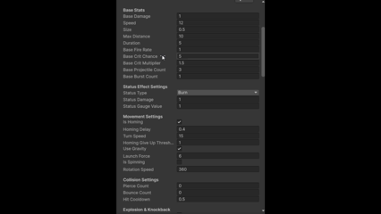
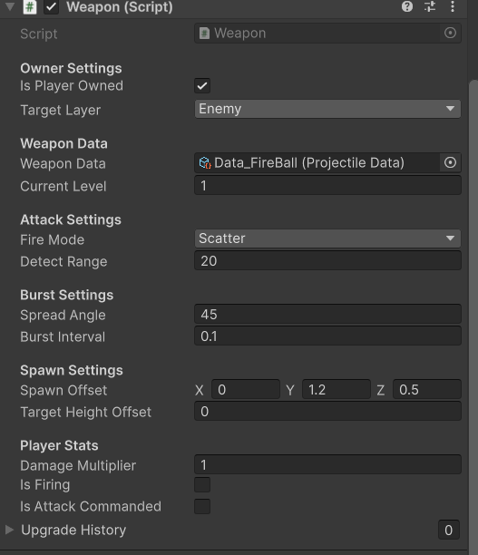

# 3D-survivors-gameplay-systems
Modular gameplay systems for a Unity 3D Survivors game, including combat, weapons, progression, and UI.

The original Unity project remains private because it contains collaborative work and proprietary assets.
This repository showcases only the gameplay systems and source code that I personally developed, along with demonstration videos.

## Weapon Framework

One of the primary goals of this project was to build a scalable weapon framework that allows designers and developers to create new weapons with minimal implementation effort.

Instead of implementing every weapon as a separate system, the framework separates weapon configuration, firing logic, projectile behavior, and damage processing into independent, reusable modules.

This architecture enables rapid weapon prototyping while reducing duplicated code and simplifying future maintenance.

### Architecture
The weapon pipeline is organized as follows:

```
WeaponData (ScriptableObject)
        │
        ▼
Weapon.cs (Weapon Logic)
        │
        ▼
Projectile Prefab
        │
        ▼
Projectile.cs
        │
        ▼
IDamageable Interface
```

Each layer has a single responsibility:

- **WeaponData** stores configurable weapon parameters.
- **Weapon.cs** handles firing logic and cooldown management.
- **Projectile Prefab** defines the weapon's visual representation.
- **Projectile.cs** controls movement, collision, and special behaviors.
- **IDamageable** provides a common interface for applying damage to any valid target.

This separation allows individual components to be reused across multiple weapon types without modifying the core combat framework.

### Rapid Weapon Creation


*Figure. Component-based weapon architecture used to configure and extend new weapon types.*



New weapons can be created by duplicating an existing `WeaponData` asset, assigning a projectile prefab, and adjusting configuration values in the Inspector.
No changes to the core weapon framework are required, allowing new gameplay content to be added quickly while preserving maintainability.

### Supported Weapon Behaviors

The framework currently supports multiple weapon behaviors through the same shared architecture.

- Projectile
- Melee
- Laser
- Meteor
- Orbit
- Homing Missile
- Explosive
- Piercing
- Bounce
- Chain Lightning

Additional weapon behaviors can be introduced by extending projectile logic or creating new prefabs without changing the existing weapon pipeline.
